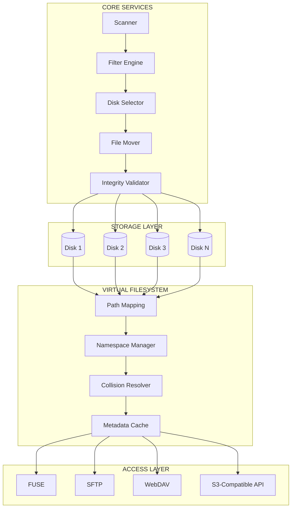

# MultiDisk FileBalancer

> High-performance software-defined storage orchestration platform that distributes files across multiple disks while exposing them as a single unified filesystem.

Inspired by RAID 0 — but safer, more flexible, and fully software-based.

---

# 🚀 Overview

MultiDisk FileBalancer is designed for:

- Automated backup storage systems
- Multi-disk setups without RAID
- Media & archive servers
- Large-scale file ingestion workflows
- Users who want scalable storage without losing everything on disk failure

Unlike RAID 0, each file is stored entirely on a single disk.

👉 If a disk fails, only the files on that disk are affected — not the entire storage pool.

---

# 🧠 Architecture

FileBalancer is structured into several modular layers:

- File processing pipeline
- Storage aggregation layer
- Virtual filesystem abstraction
- Multi-protocol access layer
- Monitoring & recovery systems

This modular design allows flexible scaling, safer storage expansion, and future extensibility.

---

# 🏗️ Architecture Diagram



---

# 🔥 Core Features

## 📦 Intelligent Multi-Disk Balancing

- Monitors one or multiple input folders
- Moves files after a configurable age
- Uses round-robin disk selection
- Ensures sufficient free space before moving
- Supports scalable multi-disk growth

---

## 🧠 Advanced Cleanup System (Space Hunter)

Automatically frees disk space when needed.

### Features

- Recursive scanning
- Folder exclusions
- File lock detection
- File stability checks
- Configurable cleanup policies

### Actions

- Delete files
- Move cold data elsewhere

### Safety Features

- Dry-run mode
- Minimum file age enforcement
- Maximum actions per cycle
- Active file protection

---

## 🔁 Reverse RAID (Optional)

Moves files back from storage disks to a central location.

Useful for:

- Reprocessing workflows
- Archival pipelines
- Migration operations
- Data consolidation

---

## 🧩 Virtual Filesystem (FUSE)

Combines all disks into one unified virtual folder.

### Features

- Merges directory structures
- Supports nested folders
- Collision-safe filename handling
- Metadata caching
- Transparent file access
- Path traversal protection

### Example

```text
file.txt → file__a1b2c3d4.txt
```

Applications interact with one unified storage layer while FileBalancer manages the physical disk layout underneath.

---

# 🌐 Multi-Protocol Access

The storage pool can be accessed simultaneously through:

| Protocol | Purpose |
|---|---|
| FUSE | Native filesystem mounting |
| SFTP | Secure remote file access |
| WebDAV | Web-based filesystem access |
| S3-Compatible API | Object storage integration |

Compatible with:

- Windows
- Linux
- macOS
- Rclone
- Nextcloud
- Backup systems
- Media servers

---

# ⚙️ FUSE Auto Setup

Automatically detects your operating system and attempts setup assistance.

### Supported Platforms

- Linux: `apt`, `dnf`, `pacman`
- Windows: `winget` (WinFsp)
- macOS: `brew` (macFUSE)

The system also detects:
- Permission issues
- Missing dependencies
- Unsupported environments

---

# 📊 Startup Preflight Check

At launch, the application displays:

- OS information
- Python version
- Privilege status
- Enabled services
- FUSE readiness
- Environment diagnostics

---

# 🔔 Monitoring & Notifications

## Discord Notifications

Send logs and events directly to a Discord webhook.

Useful for:

- Server monitoring
- Automated alerts
- Storage notifications
- Recovery warnings

## Monitoring Features

- Disk usage tracking
- Transfer logs
- Health metrics
- Usage analytics
- Recovery visibility

---

# 🛡️ Fault Tolerance

Unlike RAID 0, disk failure only affects files stored on the failed disk.

Additional safeguards include:

- File stability checks
- Corruption prevention
- Path validation
- Concurrent operation protection
- Degraded operation support
- Automatic disk reintegration support

---

# ⚡ Quick Start

```bash
pip install -r requirements.txt
python multidisk_filebalancer.py
```

On some systems:

```bash
pip install -r requirements.txt --break-system-packages
```

---

# 🧾 First Run

On first launch:

- Guided setup starts automatically
- A `config.yml` file is generated
- Optional services can be configured interactively

---

# ⚙️ Configuration Example

```yaml
src_folders:
  - "D:\\Input1"
  - "D:\\Input2"

disks:
  - name: "disk1"
    path: "E:\\Storage1"
  - name: "disk2"
    path: "F:\\Storage2"

settings:
  min_file_age_hours: 4
  extra_safety_space_gb: 5
  scan_interval_seconds: 120

space_hunter_disks:
  - action: delete
    min_free_gb: 40
    path: "E:\\Storage1"

fuse_server:
  enabled: true
  mount_point: "D:\\mount"

sftp_server:
  enabled: true
  port: 2222

webdav_server:
  enabled: false

s3_server:
  enabled: true
  port: 9000
  bucket_name: "storage"
```

---

# 🧠 How It Works

1. Load configuration
2. Perform system preflight checks
3. Start optional services:
   - FUSE mount
   - WebDAV
   - SFTP
   - S3 API
4. Enter balancing loop:
   - Scan input folders
   - Filter eligible files
   - Select target disk
   - Move files safely
5. Run background systems:
   - Space Hunter cleanup
   - Monitoring
   - Reverse RAID workflows

---

# 🖥️ Supported Platforms

- Windows (WinFsp required)
- Linux (libfuse required)
- macOS (macFUSE required)

---

# 💡 Use Cases

- Automated backup servers
- Media storage systems
- Low-cost NAS environments
- Large archive pools
- Multi-disk home servers
- File ingestion pipelines

---

# 📁 Project Structure

```text
multidisk_filebalancer.py   # Main application
config.yml                  # Auto-generated configuration
requirements.txt            # Dependencies
```

---

# 🧩 Design Philosophy

- Keep deployment simple
- Avoid RAID complexity
- Maximize storage flexibility
- Provide unified filesystem access
- Prioritize safety over striping
- Remain modular and extensible

---

# 🏁 Summary

MultiDisk FileBalancer provides:

✅ Multi-disk storage without RAID  
✅ Unified filesystem abstraction  
✅ Intelligent balancing & cleanup  
✅ Multi-protocol access  
✅ Flexible automation workflows  
✅ Safer failure isolation  
✅ Modular architecture  

---

# 📌 Future Ideas

- Web dashboard
- Metrics & graphs
- File replication mode
- Distributed node support
- Smarter balancing algorithms
- Snapshot support
