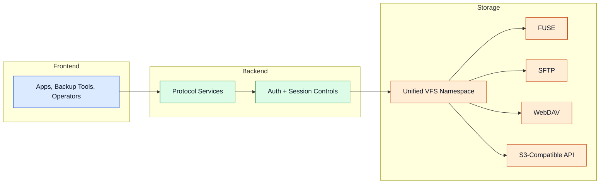

---
id: access-layer
title: Access Layer
---

# Access Layer

The access layer exposes the same storage namespace through multiple protocols for local and remote workflows.

## Protocol Gateway

## Protocols

- FUSE: native mount behavior for local filesystem access.
- SFTP: secure remote file transfer and administration.
- WebDAV: web-friendly filesystem interoperability.
- S3-Compatible API: object-style integration for automation stacks.

Advanced details

- Protocol services can be enabled independently in configuration.
- Platform setup paths vary: WinFsp, libfuse, and macFUSE ecosystems.
- Preflight checks verify permissions and dependency readiness.

## Navigation

- [Back to Intro](./intro)

## Related Pages

- [Storage Layer](./storage-layer)
- [Configuration](./configuration)
- [Use Cases](./use-cases)
