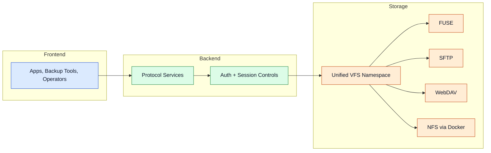

# Access Layer

De access layer stelt dezelfde storage namespace bloot via meerdere protocollen voor lokale en remote workflows.

## Protocol gateway

## Protocollen

### FUSE
Native mount-gedrag voor lokale bestandssysteemtoegang. Vereist `libfuse2` en de Python `fusepy`-binding. Het programma probeert `libfuse` automatisch te installeren als het ontbreekt. Vereist root-rechten.

### SFTP
Veilige remote bestandsoverdracht en beheer via SSH/SFTP (asyncssh). Ondersteunt lezen, schrijven, verwijderen en directory-operaties op de virtuele namespace. Standaard poort: `8081`.

### WebDAV
Web-vriendelijke bestandssysteeminteroperabiliteit (wsgidav + cheroot). Geschikt voor Windows Verkenner, macOS Finder en backup-tools. Standaard poort: `8080`.

### NFS
Network File System via een Docker-container. Vereist Docker Engine op de hostmachine. Exporteert de VFS-root als `/nfsshare`. Mount-tip: `mount <server-ip>:/ /mnt/nfs`. Standaard poort: `2049`.

> **Let op:** De S3-compatibele API (`s3_server`) is verwijderd uit het programma. Oudere `config.yml`-bestanden met een `s3_server`-sectie worden automatisch gemigreerd en die sectie wordt verwijderd.

Geavanceerde details

- Protocol-services kunnen onafhankelijk worden ingeschakeld in de configuratie.
- Als `use_fuse_mount_as_root: true`, serveert de betreffende server het FUSE-mountpunt als root — FUSE moet dan ingeschakeld en actief zijn.
- SFTP genereert automatisch een Ed25519 of RSA host-sleutel als er geen `host_key_path` geconfigureerd is.
- SFTP waarschuwt expliciet als de server alleen op `127.0.0.1` gebonden is, wat externe verbindingen blokkeert.
- Preflight-checks verifiëren rechten en dependency-gereedheid voor elke service.

## Navigatie

- [Terug naar Intro](./intro)

## Gerelateerde pagina's

- [Storage Layer](./storage-layer)
- [Configuration](./configuration)
- [Use Cases](./use-cases)
