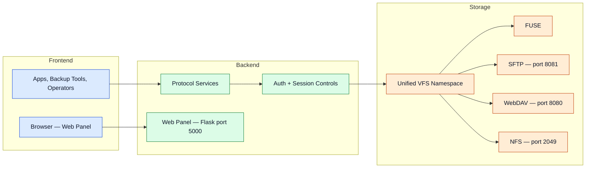

# Access Layer

The access layer exposes the same storage namespace through multiple protocols for local and remote workflows, plus a built-in web panel for monitoring and configuration.

## Protocol Gateway

## Protocols

### FUSE
Native mount behaviour for local filesystem access. Requires `libfuse2` and the Python `fusepy` binding. The program attempts to install `libfuse` automatically if it is missing. Requires root privileges.

### SFTP
Secure remote file transfer and administration via SSH/SFTP (asyncssh). Supports read, write, delete, and directory operations on the virtual namespace. Default port: `8081`.

### WebDAV
Web-friendly filesystem interoperability (wsgidav + cheroot). Compatible with Windows Explorer, macOS Finder, and backup tools. Default port: `8080`.

### NFS
Network File System access via the Linux kernel NFS daemon (`nfs-kernel-server`). The program installs `nfs-kernel-server` automatically if it is missing. Requires root or sudo to write to `/etc/exports.d/` and reload `exportfs`. Exports the VFS root as `/nfsshare`. Mount tip: `mount <server-ip>:/ /mnt/nfs`. Default port: `2049`.

> **Note:** NFS uses the Linux kernel NFS server — **Docker is not required.**

### Web Panel
A built-in Flask web dashboard for real-time monitoring and configuration. Enabled by default on port `5000`. Accessible from a browser at `http://<host>:5000`. Provides:
- Live stats via `/api/stats` (files moved, disk usage, uptime, last action)
- Config view and editor via `/api/config`
- Dashboard and Config views in the UI

> **Note:** The S3-compatible API (`s3_server`) has been removed from the program. Older `config.yml` files containing an `s3_server` section are automatically migrated and that section is dropped.

Advanced details

- Protocol services can be enabled independently in the configuration.
- When `use_fuse_mount_as_root: true`, the protocol server serves the FUSE mount point as its root — FUSE must be enabled and running first.
- SFTP automatically generates an Ed25519 or RSA host key if no `host_key_path` is configured.
- SFTP explicitly warns when the server is bound only to `127.0.0.1`, which blocks external connections.
- Preflight checks verify permissions and dependency readiness for each service.
- The Web Panel runs as a daemon thread (Flask) and silences server banner output by default.

## Navigation

- [Back to Intro](./intro)

## Related Pages

- [Storage Layer](./storage-layer)
- [Configuration](./configuration)
- [Use Cases](./use-cases)
