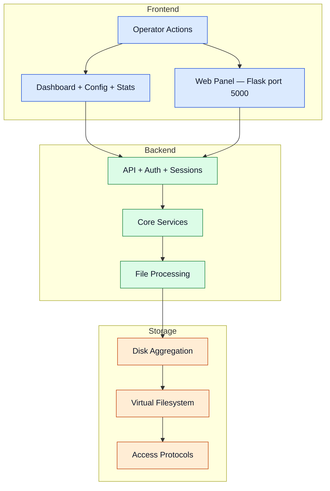

# Architecture

The architecture is intentionally split into Frontend, Backend, and Storage to keep responsibilities clear and scalable.

## Layered Architecture

## Component Boundaries

- **Frontend** handles user interaction and operational visibility, including the built-in Flask web panel.
- **Backend** handles orchestration, policy decisions, integrity, and recovery.
- **Storage** handles placement, namespace unification, metadata, and protocol serving.

Advanced details

- Monitoring and notification paths (including Discord webhooks) are attached to backend and pipeline events.
- Backup/redundancy workflows integrate with disk selection and recovery loops.
- Design supports optional services without changing the core balancing loop.
- The NFS service uses the Linux kernel NFS server (`nfs-kernel-server`) — Docker is **not** required.
- The Web Panel (Flask) runs as a daemon thread and exposes `/api/stats` and `/api/config` endpoints.

## Navigation

- [Back to Intro](./intro)

## Related Pages

- [Core Services](./core-services)
- [Processing Pipeline](./processing-pipeline)
- [Storage Layer](./storage-layer)
- [Access Layer](./access-layer)
