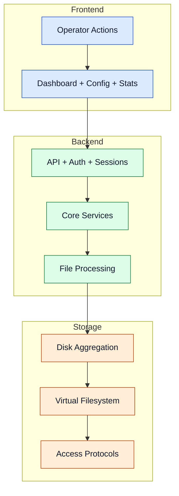

---
id: architecture
title: Architecture
---

# Architecture

The architecture is intentionally split into Frontend, Backend, and Storage to keep responsibilities clear and scalable.

## Layered Architecture

## Component Boundaries

- Frontend handles user interaction and operational visibility.
- Backend handles orchestration, policy decisions, integrity, and recovery.
- Storage handles placement, namespace unification, metadata, and protocol serving.

Advanced details

- Monitoring and notification paths are attached to backend and pipeline events.
- Backup/redundancy workflows integrate with disk selection and recovery loops.
- Design supports optional services without changing the core balancing loop.

## Navigation

- [Back to Intro](./intro)

## Related Pages

- [Core Services](./core-services)
- [Processing Pipeline](./processing-pipeline)
- [Storage Layer](./storage-layer)
