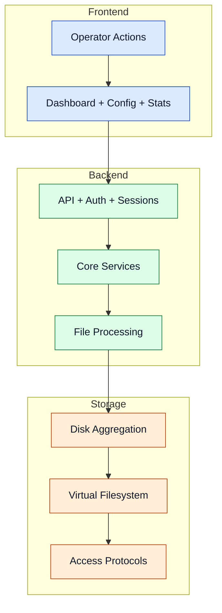

# Architecture

De architectuur is bewust opgesplitst in Frontend, Backend en Storage om verantwoordelijkheden duidelijk en schaalbaar te houden.

## Gelaagde architectuur

## Component grenzen

- **Frontend** behandelt gebruikersinteractie en operationele zichtbaarheid.
- **Backend** behandelt orchestratie, beleidsbeslissingen, integriteit en herstel.
- **Storage** behandelt plaatsing, namespace-unificatie, metadata en protocol-serving.

Geavanceerde details

- Monitoring- en notificatiepaden (inclusief Discord webhooks) zijn gekoppeld aan backend- en pipeline-events.
- Backup/redundantie-workflows integreren met schijfselectie en herstellussen.
- Het ontwerp ondersteunt optionele services zonder de kernbalanceringsloop te wijzigen.
- NFS-service vereist Docker Engine op de host voor containerisatie van de NFS-daemon.

## Navigatie

- [Terug naar Intro](./intro)

## Gerelateerde pagina's

- [Core Services](./core-services)
- [Processing Pipeline](./processing-pipeline)
- [Storage Layer](./storage-layer)
