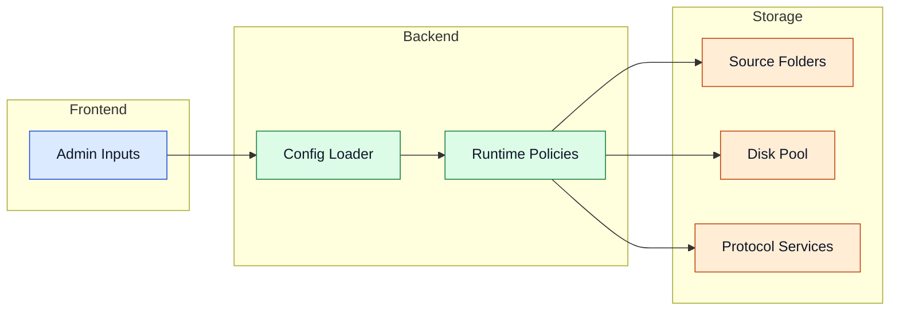

---
id: configuration
title: Configuration
---

# Configuration

Configuration controls data sources, disk pool layout, runtime safety, and optional services.

## Configuration Scope



## Example `config.yml`

```yaml
src_folders:
  - "D:\\Input1"
  - "D:\\Input2"

disks:
  - name: "disk1"
    path: "E:\\Storage1"
  - name: "disk2"
    path: "F:\\Storage2"

settings:
  min_file_age_hours: 4
  extra_safety_space_gb: 5
  scan_interval_seconds: 120

space_hunter_disks:
  - action: delete
    min_free_gb: 40
    path: "E:\\Storage1"

fuse_server:
  enabled: true
  mount_point: "D:\\mount"

sftp_server:
  enabled: true
  port: 2222

webdav_server:
  enabled: false

s3_server:
  enabled: true
  port: 9000
  bucket_name: "storage"
```

## Option Breakdown

- `src_folders`: input roots to scan for candidate files.
- `disks`: target storage devices in the pool.
- `settings.min_file_age_hours`: minimum age before movement.
- `settings.extra_safety_space_gb`: reserved free space buffer.
- `settings.scan_interval_seconds`: scheduler loop frequency.
- `space_hunter_disks`: cleanup strategy and free-space goals.
- `fuse_server`, `sftp_server`, `webdav_server`, `s3_server`: protocol toggles and endpoint settings.

<details>
<summary>Advanced details</summary>

- Use dry-run validation for cleanup policy verification.
- Align safety-space thresholds with ingest burst profiles.
- Keep ports and mount targets explicit to avoid runtime ambiguity.

</details>

## Navigation

- [Back to Intro](./intro)

## Related Pages

- [Core Services](./core-services)
- [Processing Pipeline](./processing-pipeline)
- [Access Layer](./access-layer)
