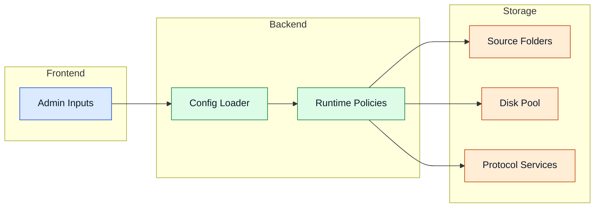

# Configuration

Configuratie bepaalt databronnen, schijfpoolindeling, runtime-veiligheid en optionele services.

## Configuratiebereik



## Volledig `config.yml` voorbeeld

```yaml
# Bronmappen — hier worden nieuwe bestanden gescand
src_folders:
  - "/media/sf_MultiDisk-FileBalancer/src"

# Doelschijven in de pool
disks:
  - name: "disk1"
    path: "/media/sf_MultiDisk-FileBalancer/out1"
  - name: "disk2"
    path: "/media/sf_MultiDisk-FileBalancer/out2"
  - name: "disk3"
    path: "/media/sf_MultiDisk-FileBalancer/out3"

# Laatste gebruikte schijf (automatisch bijgehouden)
last_disk: disk1

# Discord webhook voor notificaties (leeg laten om uit te schakelen)
webhook_url: ''

# Algemene instellingen
settings:
  min_file_age_hours: 4
  extra_safety_space_gb: 5
  scan_interval_seconds: 120
  console_clear_interval_hours: 6
  space_check_default_min_free_gb: 10

  # Space Hunter instellingen
  space_hunter_min_file_age_hours: 1
  space_hunter_exclude_folders: []
  space_hunter_dry_run: false
  space_hunter_max_actions_per_cycle: 0
  space_hunter_global_fallback: false

# Automatische schijfruimte-bewaking en cleanup
space_hunter_disks:
  - action: delete           # 'delete' of 'move'
    min_free_gb: 40
    path: "/media/sf_MultiDisk-FileBalancer/out1"
    move_destination: null   # verplicht als action: move

# Reverse workflow — bestanden terugzetten naar bronmap
reverse_raid:
  enabled: false
  source_paths:
    - "/media/sf_MultiDisk-FileBalancer/out1"
    - "/media/sf_MultiDisk-FileBalancer/out2"
  destination_path: "/media/sf_MultiDisk-FileBalancer/src"
  min_file_age_hours: 12
  run_interval_minutes: 10

# FUSE mount (unified virtuele schijfweergave)
fuse_server:
  enabled: true
  mount_point: "/mnt/vfs"
  upload_src: "/media/sf_MultiDisk-FileBalancer/src"

# WebDAV server
webdav_server:
  enabled: true
  host: "0.0.0.0"
  port: 8080
  username: "admin"
  password: "changeme"
  upload_src: "/media/sf_MultiDisk-FileBalancer/src"
  use_fuse_mount_as_root: true

# SFTP server
sftp_server:
  enabled: true
  host: "0.0.0.0"
  port: 8081
  username: "raiduser"
  password: "changeme"
  upload_src: "/media/sf_MultiDisk-FileBalancer/src"
  use_fuse_mount_as_root: true

# NFS server (vereist Docker op de host)
nfs_server:
  enabled: false
  host: "0.0.0.0"
  port: 2049
  permitted: "*"
  upload_src: "/media/sf_MultiDisk-FileBalancer/src"
  use_fuse_mount_as_root: true
```

## Optie-overzicht

### Basisconfiguratie

| Optie | Beschrijving |
|---|---|
| `src_folders` | Invoermappen die gescand worden op kandidaat-bestanden. |
| `disks` | Doelopslagapparaten in de pool (naam + pad). |
| `last_disk` | Laatste gebruikte schijf — automatisch bijgehouden door het programma. |
| `webhook_url` | Discord webhook URL voor notificaties. Leeg laten om uit te schakelen. |

### Settings

| Optie | Beschrijving |
|---|---|
| `min_file_age_hours` | Minimale leeftijd van een bestand voordat het verplaatst mag worden. |
| `extra_safety_space_gb` | Gereserveerde vrije ruimtebuffer op elke schijf. |
| `scan_interval_seconds` | Frequentie van de schedulerloop. |
| `console_clear_interval_hours` | Hoe vaak de console gewist wordt. |
| `space_check_default_min_free_gb` | Standaard vrije-ruimtedrempel voor Space Hunter. |

### Space Hunter

| Optie | Beschrijving |
|---|---|
| `space_hunter_min_file_age_hours` | Minimale bestandsleeftijd voor cleanup-kandidaten. |
| `space_hunter_exclude_folders` | Mappen die uitgesloten worden van cleanup. |
| `space_hunter_dry_run` | `true` = simuleer cleanup zonder echte verwijdering. |
| `space_hunter_max_actions_per_cycle` | Maximaal aantal acties per cyclus (`0` = onbeperkt). |
| `space_hunter_global_fallback` | `true` = globale fallback-cleanup over alle onder druk staande schijven. |

### Space Hunter Disks

| Optie | Beschrijving |
|---|---|
| `action` | `delete` = oudste bestand verwijderen, `move` = verplaatsen naar `move_destination`. |
| `min_free_gb` | Vrije ruimtedrempel waaronder cleanup geactiveerd wordt. |
| `path` | Pad van de te bewaken schijf. |
| `move_destination` | Bestemmingspad bij `action: move`. |

### Reverse Raid

| Optie | Beschrijving |
|---|---|
| `enabled` | Reverse workflow aan/uit. |
| `source_paths` | Schijfpaden waarvan bestanden teruggezet worden. |
| `destination_path` | Bestemmingsmap voor teruggeplaatste bestanden. |
| `min_file_age_hours` | Minimale leeftijd voor reverse-kandidaten. |
| `run_interval_minutes` | Hoe vaak de reverse workflow draait. |

### Protocol servers

Elke server heeft minstens `enabled`, `host`, `port`, `username` en `password`. De extra opties:

| Optie | Beschrijving |
|---|---|
| `upload_src` | Bronmap voor uploads via dit protocol. |
| `use_fuse_mount_as_root` | `true` = serveer het FUSE-mountpunt als root in plaats van `upload_src`. |
| `nfs_server.permitted` | IP-patroon van toegestane NFS-clients (bijv. `*` of `192.168.1.*`). |

> **Let op:** De NFS-server vereist Docker op de host. Zonder Docker kan de NFS-server niet starten.

> **Let op:** De S3-compatibele server die in oudere configuratiebestanden voorkomt (`s3_server`) is verwijderd uit het programma en wordt genegeerd.

<details>
<summary>Geavanceerde details</summary>

- Gebruik `space_hunter_dry_run: true` voor verificatie van cleanup-beleid zonder risico.
- Stem `extra_safety_space_gb` af op piekingest-profielen.
- Houd poorten en mountpunten expliciet om runtime-ambiguïteit te vermijden.
- Als `use_fuse_mount_as_root: true` is, dient de FUSE-server ingeschakeld en actief te zijn voordat de protocol-server start.

</details>

## Navigatie

- [Terug naar Intro](./intro)

## Gerelateerde pagina's

- [Core Services](./core-services)
- [Processing Pipeline](./processing-pipeline)
- [Access Layer](./access-layer)
