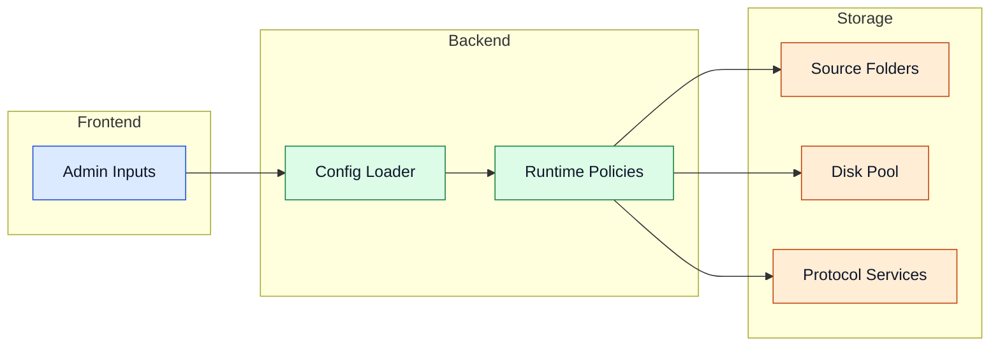

# Configuration

Configuration controls data sources, disk pool layout, runtime safety, and optional services.

## Configuration Scope



## Full `config.yml` Example

```yaml
# Source folders — scanned for new files
src_folders:
  - "/media/sf_MultiDisk-FileBalancer/src"

# Target disks in the pool
disks:
  - name: "disk1"
    path: "/media/sf_MultiDisk-FileBalancer/out1"
  - name: "disk2"
    path: "/media/sf_MultiDisk-FileBalancer/out2"
  - name: "disk3"
    path: "/media/sf_MultiDisk-FileBalancer/out3"

# Last used disk (automatically tracked by the program)
last_disk: disk1

# Discord webhook for notifications (leave empty to disable)
webhook_url: ''

# General settings
settings:
  min_file_age_hours: 4
  extra_safety_space_gb: 5
  scan_interval_seconds: 120
  console_clear_interval_hours: 6
  space_check_default_min_free_gb: 10

  # Space Hunter settings
  space_hunter_min_file_age_hours: 1
  space_hunter_exclude_folders: []
  space_hunter_dry_run: false
  space_hunter_max_actions_per_cycle: 0
  space_hunter_global_fallback: false

# Automatic disk space monitoring and cleanup
space_hunter_disks:
  - action: delete           # 'delete' or 'move'
    min_free_gb: 40
    path: "/media/sf_MultiDisk-FileBalancer/out1"
    move_destination: null   # required when action: move

# Reverse workflow — move files back to source folder
reverse_raid:
  enabled: false
  source_paths:
    - "/media/sf_MultiDisk-FileBalancer/out1"
    - "/media/sf_MultiDisk-FileBalancer/out2"
  destination_path: "/media/sf_MultiDisk-FileBalancer/src"
  min_file_age_hours: 12
  run_interval_minutes: 10

# FUSE mount (unified virtual disk view)
fuse_server:
  enabled: true
  mount_point: "/mnt/vfs"
  upload_src: "/media/sf_MultiDisk-FileBalancer/src"

# WebDAV server
webdav_server:
  enabled: true
  host: "0.0.0.0"
  port: 8080
  username: "admin"
  password: "changeme"
  upload_src: "/media/sf_MultiDisk-FileBalancer/src"
  use_fuse_mount_as_root: true

# SFTP server
sftp_server:
  enabled: true
  host: "0.0.0.0"
  port: 8081
  username: "raiduser"
  password: "changeme"
  upload_src: "/media/sf_MultiDisk-FileBalancer/src"
  use_fuse_mount_as_root: true

# NFS server (requires root or sudo — uses Linux kernel nfs-kernel-server)
nfs_server:
  enabled: false
  host: "0.0.0.0"
  port: 2049
  permitted: "*"
  upload_src: "/media/sf_MultiDisk-FileBalancer/src"
  use_fuse_mount_as_root: true
```

## Option Breakdown

### Base Configuration

| Option | Description |
|---|---|
| `src_folders` | Input roots scanned for candidate files. Supports multiple paths as a list. The legacy single-path key `src:` is also accepted for backwards compatibility. |
| `disks` | Target storage devices in the pool (name + path). |
| `last_disk` | Last used disk — automatically tracked by the program. |
| `webhook_url` | Discord webhook URL for notifications. Leave empty to disable. |

### Settings

| Option | Description |
|---|---|
| `min_file_age_hours` | Minimum file age before it may be moved. |
| `extra_safety_space_gb` | Reserved free space buffer on each disk. |
| `scan_interval_seconds` | Scheduler loop frequency. |
| `console_clear_interval_hours` | How often the console is cleared. |
| `space_check_default_min_free_gb` | Default free space threshold for Space Hunter. |

### Space Hunter

| Option | Description |
|---|---|
| `space_hunter_min_file_age_hours` | Minimum file age for cleanup candidates. |
| `space_hunter_exclude_folders` | Folders excluded from cleanup. |
| `space_hunter_dry_run` | `true` = simulate cleanup without actual deletion. |
| `space_hunter_max_actions_per_cycle` | Max actions per cycle (`0` = unlimited). |
| `space_hunter_global_fallback` | `true` = global fallback cleanup across all disks under pressure. |

### Space Hunter Disks

| Option | Description |
|---|---|
| `action` | `delete` = remove oldest file, `move` = move to `move_destination`. |
| `min_free_gb` | Free space threshold below which cleanup activates. |
| `path` | Path of the disk to monitor. |
| `move_destination` | Destination path when `action: move`. |
| `min_file_age_hours` | *(optional)* Per-disk override for minimum file age. Falls back to the global `space_hunter_min_file_age_hours`. |
| `exclude_folders` | *(optional)* Per-disk list of folders excluded from cleanup. Falls back to the global `space_hunter_exclude_folders`. |
| `dry_run` | *(optional)* Per-disk dry-run override. Falls back to the global `space_hunter_dry_run`. |
| `max_actions_per_cycle` | *(optional)* Per-disk action limit per cycle. Falls back to the global `space_hunter_max_actions_per_cycle`. |

### Reverse Raid

| Option | Description |
|---|---|
| `enabled` | Enable/disable the reverse workflow. |
| `source_paths` | Disk paths from which files are moved back. |
| `destination_path` | Target folder for returned files. |
| `min_file_age_hours` | Minimum age for reverse candidates. |
| `run_interval_minutes` | How often the reverse workflow runs. |

### Protocol Servers

Each server has at minimum `enabled`, `host`, `port`, `username`, and `password`. Additional options:

| Option | Description |
|---|---|
| `upload_src` | Source folder for uploads via this protocol. |
| `use_fuse_mount_as_root` | `true` = serve the FUSE mount point as root instead of `upload_src`. |
| `nfs_server.permitted` | IP pattern of allowed NFS clients (e.g. `*` or `192.168.1.*`). |
| `sftp_server.host_key_path` | *(optional)* Path to an existing SSH host key file. If omitted, an Ed25519 and RSA key are generated automatically in memory on each start. |

> **Note:** The NFS server uses the Linux kernel NFS daemon (`nfs-kernel-server`). The program installs it automatically if missing, but requires root or sudo to write to `/etc/exports.d/` and reload `exportfs`. Custom ports are not supported — NFS always uses port `2049`.

> **Note:** The S3-compatible server (`s3_server`) found in older config files has been removed from the program and is ignored.

<details>
<summary>Advanced details</summary>

- Use `space_hunter_dry_run: true` to verify cleanup policy without risk.
- Align `extra_safety_space_gb` with ingest burst profiles.
- Keep ports and mount targets explicit to avoid runtime ambiguity.
- When `use_fuse_mount_as_root: true`, FUSE must be enabled and running before the protocol server starts.

</details>

## Navigation

- [Back to Intro](./intro)

## Related Pages

- [Core Services](./core-services)
- [Processing Pipeline](./processing-pipeline)
- [Access Layer](./access-layer)
