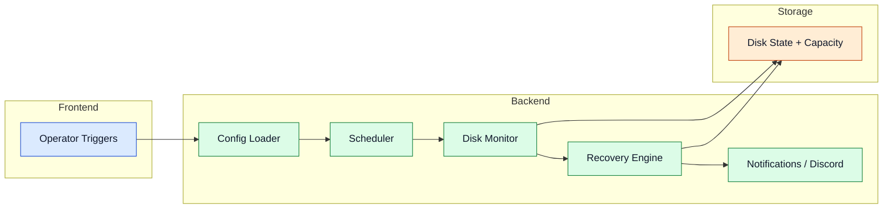

# Core Services

Core services coördineren scheduling, gezondheid en systeemveiligheid vóór en tijdens bestandsoperaties.

## Service coördinatie

## Componenten

- **Config Loader:** valideert opstartconfiguratie en service-toggles. Bij ontbrekend `config.yml` start een interactieve wizard.
- **Scheduler:** orkestreert terugkerende scan- en onderhoudscycli op basis van `scan_interval_seconds`.
- **Disk Monitor:** houdt vrije ruimte, beschikbaarheid en gezondheidsstatussen bij.
- **Recovery Engine:** ondersteunt gedegradeerde werking en herintegration na schijfherstel.
- **Notifications:** stuurt operationele events en waarschuwingen via Discord webhook of console-output.

## Startup preflight

Bij elke start voert het programma een preflight-check uit die rapporteert over:

- OS en Python-versie
- Admin/root-rechten
- FUSE-beschikbaarheid en mount-punt
- Ingeschakelde services (FUSE, WebDAV, SFTP, NFS)
- Installatieadvies voor ontbrekende dependencies

Deze output verschijnt zowel in de console als via de Discord webhook (indien geconfigureerd).

## Discord notificaties

Configureer `webhook_url` in `config.yml` met een Discord webhook URL om meldingen te ontvangen over:

- Bestandsverplaatsingen en -verwijderingen
- Schijfruimtewaarschuwingen
- Server-opstartstatussen
- Fouten en herstelgebeurtenissen

Laat `webhook_url` leeg of weg om notificaties uit te schakelen.

Geavanceerde details

- Startup preflight kan service-inschakeling blokkeren op basis van dependency-gereedheid.
- Recovery integreert met validatie-uitkomsten en schijfgezondheidstelemetrie.
- Notificaties sturen naar één Discord webhook; voor meerdere kanalen kan een Discord-bot als doorstuurpunt dienen.
- De NFS-service vereist Docker Engine; als Docker ontbreekt, wordt de NFS-server niet gestart en verschijnt een foutmelding.

## Navigatie

- [Terug naar Intro](./intro)

## Gerelateerde pagina's

- [Architecture](./architecture)
- [Processing Pipeline](./processing-pipeline)
- [Storage Layer](./storage-layer)
