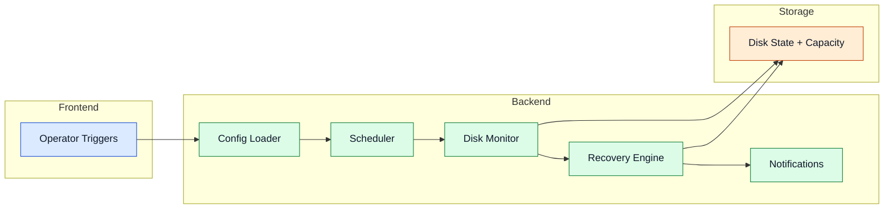

---
id: core-services
title: Core Services
---

# Core Services

Core services coordinate scheduling, health, and system safety before and during file operations.

## Service Coordination

## Components

- Config Loader: validates startup configuration and service toggles.
- Scheduler: orchestrates recurring scan and maintenance cycles.
- Disk Monitor: tracks free space, availability, and health indicators.
- Recovery Engine: supports degraded operation and reintegration.
- Notifications: emits operational events and warning signals.

Advanced details

- Startup preflight can gate service enablement based on dependency readiness.
- Recovery integrates with validation outcomes and disk health telemetry.
- Notifications can map to webhooks for remote alerting and observability.

## Navigation

- [Back to Intro](./intro)

## Related Pages

- [Architecture](./architecture)
- [Processing Pipeline](./processing-pipeline)
- [Storage Layer](./storage-layer)
