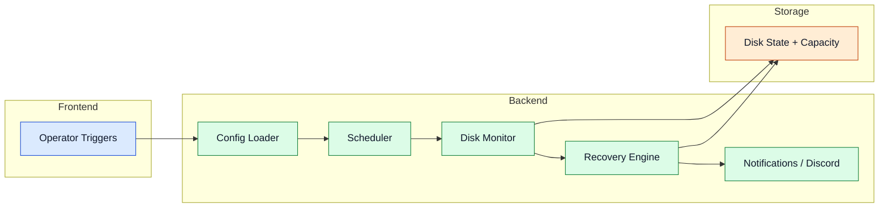

# Core Services

Core services coordinate scheduling, health, and system safety before and during file operations.

## Service Coordination

## Components

- **Config Loader:** validates startup configuration and service toggles. Launches an interactive setup wizard when no `config.yml` is present.
- **Scheduler:** orchestrates recurring scan and maintenance cycles based on `scan_interval_seconds`.
- **Disk Monitor:** tracks free space, availability, and health indicators.
- **Recovery Engine:** supports degraded operation and reintegration after disk recovery.
- **Notifications:** emits operational events and warnings via Discord webhook or console output.

## Startup Preflight

On every start the program runs a preflight check that reports:

- OS and Python version
- Admin/root privileges
- FUSE availability and mount point
- Enabled services (FUSE, WebDAV, SFTP, NFS)
- Installation advice for missing dependencies

This output appears both in the console and via the Discord webhook (if configured).

## Discord Notifications

Set `webhook_url` in `config.yml` to a Discord webhook URL to receive alerts about:

- File moves and deletions
- Disk space warnings
- Server startup statuses
- Errors and recovery events

Leave `webhook_url` empty or omit it to disable notifications.

Advanced details

- Startup preflight can gate service enablement based on dependency readiness.
- Recovery integrates with validation outcomes and disk health telemetry.
- Notifications post to a single Discord webhook; a Discord bot can be used as a relay for multiple channels.
- The NFS service uses the Linux kernel NFS server (`nfs-kernel-server`), installed automatically if missing. It requires root or sudo to write export entries and reload `exportfs`.

## Navigation

- [Back to Intro](./intro)

## Related Pages

- [Architecture](./architecture)
- [Processing Pipeline](./processing-pipeline)
- [Storage Layer](./storage-layer)
