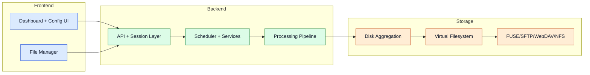

# MultiDisk FileBalancer

MultiDisk FileBalancer is a software-defined storage orchestration platform that distributes files across multiple disks while exposing one unified filesystem view.

> **Requirement:** The program runs on Linux only. Windows is not supported — including WSL. Use a Linux VM (e.g. Debian in VirtualBox). See the [Virtualisation Guide](./virtualisation) for a step-by-step setup.

## System At A Glance

## What This System Solves

- Multi-disk balancing without RAID striping risk.
- Failure isolation: one failed disk only impacts files stored on that disk.
- Unified namespace via virtual filesystem abstraction.
- Multi-protocol access for local and remote clients (FUSE, SFTP, WebDAV, NFS).
- Background safety and operational checks.
- Automatic disk space monitoring and cleanup via Space Hunter.
- Discord notifications for operational events and warnings.

Advanced details

- Startup preflight checks OS, Python, privileges, dependencies, and FUSE readiness.
- Optional support services include reverse workflows, cleanup automation, monitoring, and notifications.
- Design emphasizes modular growth and safer expansion over tight RAID coupling.
- NFS is served via a Docker container and requires Docker Engine on the host.

## Components Overview

- **Frontend:** Dashboard, configuration interface, file manager, observability views.
- **Backend:** API, authentication/session flow, scheduler, disk monitor, recovery, pipeline logic.
- **Storage:** Aggregation layer, physical disks, metadata mapping, VFS, access protocols.

## Related Pages

- [Architecture](./architecture)
- [Core Services](./core-services)
- [Processing Pipeline](./processing-pipeline)
- [Storage Layer](./storage-layer)
- [Access Layer](./access-layer)
- [Configuration](./configuration)
- [Use Cases](./use-cases)
- [Virtualisation Guide](./virtualisation)
