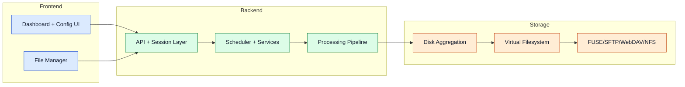

# MultiDisk FileBalancer

MultiDisk FileBalancer is een software-defined storage orchestration platform dat bestanden verdeelt over meerdere schijven en tegelijkertijd één unified filesystem-weergave aanbiedt.

> **Vereiste:** Het programma draait uitsluitend op Linux. Windows wordt niet ondersteund — ook WSL niet. Gebruik een Linux VM (bijv. Debian in VirtualBox). Zie de [Virtualisatiegids](./virtualisatie) voor een stap-voor-stap installatie.

## Systeem in één oogopslag

## Wat dit systeem oplost

- Multi-disk balancing zonder RAID-striping risico.
- Failure isolation: één defecte schijf raakt alleen de bestanden op die schijf.
- Unified namespace via virtual filesystem abstractie.
- Multi-protocol toegang voor lokale en remote clients (FUSE, SFTP, WebDAV, NFS).
- Achtergrond veiligheidschecks en operationele controles.
- Automatische schijfruimte-bewaking en cleanup via Space Hunter.
- Discord-notificaties voor operationele events en waarschuwingen.

Geavanceerde details

- Startup preflight controleert OS, Python, rechten, dependencies en FUSE-gereedheid.
- Optionele ondersteunende services zijn: reverse workflows, cleanup-automatisering, monitoring en notificaties.
- Het ontwerp legt de nadruk op modulaire groei en veiliger uitbreiden boven strakke RAID-koppeling.
- NFS wordt aangeboden via een Docker-container (vereist Docker Engine op de host).

## Componentenoverzicht

- **Frontend:** Dashboard, configuratie-interface, file manager, observability views.
- **Backend:** API, authenticatie/sessie-flow, scheduler, disk monitor, recovery, pipeline-logica.
- **Storage:** Aggregatielaag, fysieke schijven, metadata-mapping, VFS, toegangsprotocollen.

## Gerelateerde pagina's

- [Architecture](./architecture)
- [Core Services](./core-services)
- [Processing Pipeline](./processing-pipeline)
- [Storage Layer](./storage-layer)
- [Access Layer](./access-layer)
- [Configuration](./configuration)
- [Use Cases](./use-cases)
- [Virtualisatiegids](./virtualisatie)
