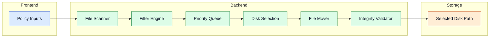

# Processing Pipeline

De processing pipeline verplaatst geschikte bestanden veilig van invoermappen naar geselecteerde opslagdoelen.

## Pipeline flow

## Componenten

- **File Scanner:** ontdekt recursief kandidaat-bestanden in de geconfigureerde `src_folders`.
- **Filter Engine:** past leeftijdscontroles, uitsluitingen, lock-checks en stabiliteitschecks toe. Een bestand wordt overgeslagen als het te jong is (`min_file_age_hours`), in gebruik is of actief wijzigt.
- **Priority Queue:** ordent kandidaat-werk voor voorspelbare doorvoer.
- **Disk Selection Logic:** round-robin plus veiligheidsruimte- en geschiktheidscontroles. Een schijf wordt overgeslagen als de vrije ruimte onder `extra_safety_space_gb` valt.
- **File Mover:** voert overdracht uit met collision-safe naamgeving (automatische hernoeming bij conflicten).
- **Validation:** bevestigt move-integriteit en consistentie vóór voltooiing.

## Space Hunter (cleanup automatisering)

Space Hunter draait parallel aan de standaard pipeline en bewaakt geconfigureerde schijven op vrije ruimte. Als een schijf onder de `min_free_gb`-drempel valt:

1. Het oudste, niet-gelocked, stabiele bestand wordt gevonden.
2. Afhankelijk van `action`: het bestand wordt verwijderd of verplaatst naar `move_destination`.
3. De actie wordt gelogd (en via Discord gemeld indien geconfigureerd).

Gebruik `space_hunter_dry_run: true` om het gedrag te simuleren zonder daadwerkelijke wijzigingen.

## Reverse Workflow

De reverse workflow verplaatst bestanden terug van schijven naar de bronmap — handig voor herverwerking of migratie. Configureer via `reverse_raid` in `config.yml`. De workflow draait periodiek op basis van `run_interval_minutes`.

Geavanceerde details

- Cleanup-automatisering kan parallel draaien om minimale vrije-ruimtedoelen af te dwingen.
- Optionele reverse workflows kunnen data terugzetten voor herverwerking of migratie.
- Actielimieten (`space_hunter_max_actions_per_cycle`) en dry-run-modi verminderen operationeel risico tijdens onderhoud.
- Global fallback (`space_hunter_global_fallback: true`) activeert cleanup over alle schijven onder druk als de primaire schijf geen geschikte bestanden heeft.

## Navigatie

- [Terug naar Intro](./intro)

## Gerelateerde pagina's

- [Core Services](./core-services)
- [Storage Layer](./storage-layer)
- [Configuration](./configuration)
