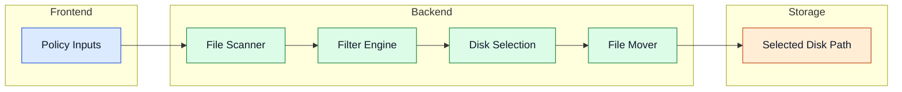

# Processing Pipeline

The processing pipeline moves eligible files safely from input folders to selected storage targets.

## Pipeline Flow

## Components

- **File Scanner:** recursively discovers candidate files in the configured `src_folders`. Symlinks are skipped.
- **Filter Engine:** applies a minimum age check (`min_file_age_hours`). Files that are too young are skipped and logged.
- **Disk Selection Logic:** round-robin plus safety-space and eligibility controls. A disk is skipped if free space falls below `extra_safety_space_gb`.
- **File Mover:** performs transfer using `shutil.move` with collision-safe naming (automatic hash-based rename on conflict).

## Space Hunter (Cleanup Automation)

Space Hunter runs in parallel with the standard pipeline and monitors configured disks for free space. When a disk falls below the `min_free_gb` threshold:

1. The oldest file is found recursively (symlinks are skipped).
2. Lock and stability checks are applied: locked or actively-changing files are skipped (up to `max_rescans` attempts).
3. Depending on `action`: the file is deleted or moved to `move_destination`.
4. The action is logged (and reported via Discord if configured).

Each disk entry in `space_hunter_disks` can override `exclude_folders`, `min_file_age_hours`, `dry_run`, and `max_actions_per_cycle` independently of the global settings.

Use `space_hunter_dry_run: true` to simulate behaviour without making any actual changes.

## Reverse Workflow

The reverse workflow moves files back from disks to the source folder — useful for reprocessing or migration. Configure via `reverse_raid` in `config.yml`. The workflow runs periodically based on `run_interval_minutes`.

Advanced details

- Cleanup automation can run in parallel to enforce minimum free space goals.
- Optional reverse workflows can move data back for reprocessing or migration.
- Action limits (`space_hunter_max_actions_per_cycle`) and dry-run modes reduce operational risk during maintenance.
- Global fallback (`space_hunter_global_fallback: true`) triggers cleanup across all disks under pressure when the primary disk has no eligible files.

## Navigation

- [Back to Intro](./intro)

## Related Pages

- [Core Services](./core-services)
- [Storage Layer](./storage-layer)
- [Configuration](./configuration)
