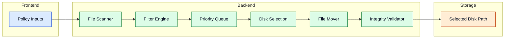

---
id: processing-pipeline
title: Processing Pipeline
---

# Processing Pipeline

The processing pipeline moves eligible files safely from input folders to selected storage targets.

## Pipeline Flow

## Components

- File Scanner: recursively discovers candidate files.
- Filter Engine: applies age, exclusions, lock checks, and stability checks.
- Priority Queue: orders candidate work for predictable throughput.
- Disk Selection Logic: round-robin plus safety-space and eligibility controls.
- File Mover: performs transfer with collision-safe naming behavior.
- Validation: confirms move integrity and consistency before completion.

Advanced details

- Cleanup automation can run in parallel to enforce minimum free space goals.
- Optional reverse workflows can move data back for reprocessing or migration.
- Action limits and dry-run modes reduce operational risk during maintenance.

## Navigation

- [Back to Intro](./intro)

## Related Pages

- [Core Services](./core-services)
- [Storage Layer](./storage-layer)
- [Configuration](./configuration)
