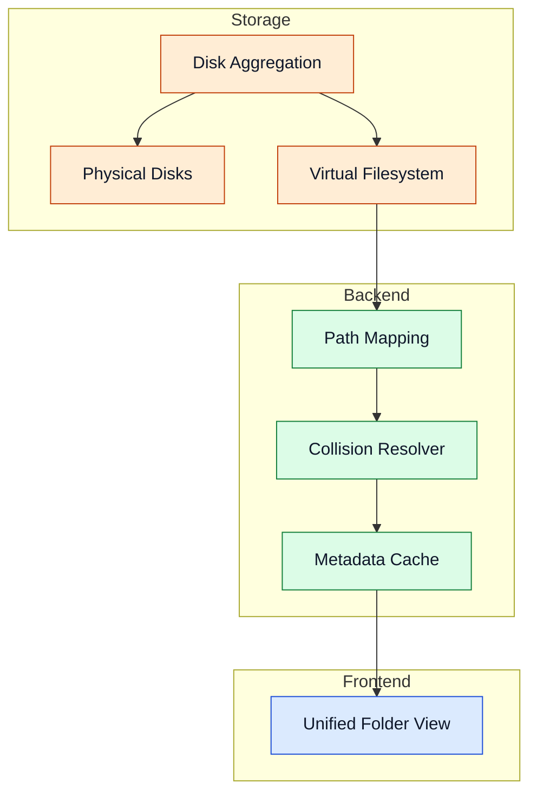

# Storage Layer

De storage layer aggregeert meerdere fysieke schijven en stelt één unified virtuele namespace beschikbaar.

## Aggregatie en VFS

## Componenten

- **Disk Aggregation:** normaliseert schijfpoolgedrag over onafhankelijke apparaten.
- **Physical Disks:** bevatten volledige bestanden — geen striping over schijven.
- **Virtual Filesystem (VFS):** biedt één logische directorynamespace voor alle protocols.
- **Path Mapping:** mapt virtuele paden naar fysieke locaties.
- **Metadata Handling:** cachet toegangsmetadata voor snellere resolutie (TTL: 2 seconden).
- **Collision Resolver:** voorkomt bestandsnaamconflicten deterministisch via hash-gebaseerde hernoeming.

Geavanceerde details

- Path traversal-protecties verdedigen tegen onveilige padconstructie.
- Gedegradeerde modus blijft gezonde schijven bedienen tijdens gedeeltelijke uitval.
- Herintegration kan volledige poolzichtbaarheid herstellen na schijfherstel.
- De VFS-cache wordt automatisch ongeldig gemaakt na bestandsoperaties.

## Navigatie

- [Terug naar Intro](./intro)

## Gerelateerde pagina's

- [Architecture](./architecture)
- [Access Layer](./access-layer)
- [Configuration](./configuration)
