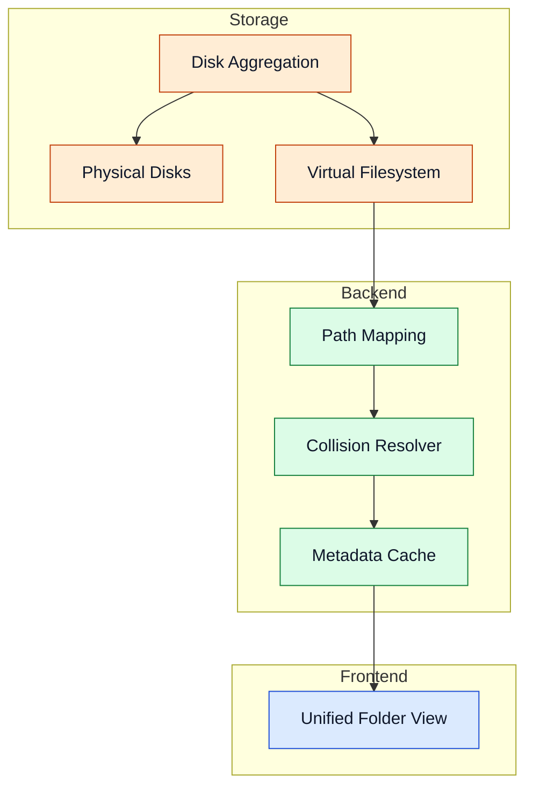

---
id: storage-layer
title: Storage Layer
---

# Storage Layer

The storage layer aggregates multiple physical disks and exposes a unified virtual namespace.

## Aggregation And VFS

## Components

- Disk Aggregation: normalizes disk pool behavior across independent devices.
- Physical Disks: hold full files; no striping across disks.
- Virtual Filesystem (VFS): provides one logical directory namespace.
- Path Mapping: maps virtual paths to physical locations.
- Metadata Handling: caches access metadata for faster resolution.
- Collision Resolver: prevents filename conflicts deterministically.

Advanced details

- Path traversal protections defend against unsafe path construction.
- Degraded mode continues serving healthy disks during partial failure.
- Reintegration can restore full pool visibility after disk recovery.

## Navigation

- [Back to Intro](./intro)

## Related Pages

- [Architecture](./architecture)
- [Access Layer](./access-layer)
- [Configuration](./configuration)
