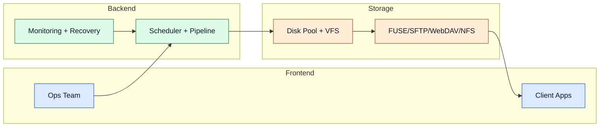

# Use Cases

These scenarios show practical deployments of MultiDisk FileBalancer in production-like environments.

## Scenario Map

## Real-Life Examples

- **Automated backup server:** ingest backup outputs, age-gate transfers, and protect free space with cleanup rules.
- **Media archive platform:** unify multiple disks under one namespace and serve remote reads over SFTP or WebDAV.
- **Home or SMB NAS:** expand storage incrementally without RAID striping constraints.
- **Data ingestion pipeline:** collect files rapidly, prioritize queue execution, and validate post-move integrity.
- **Migration and reprocessing:** use reverse workflows to bring files back to central processing stages.
- **Linux VM environment:** run the program inside a Debian VM on VirtualBox with shared folders as the disk pool — see the [Virtualisation Guide](./virtualisation).

## Practical Scenarios

- **Disk failure handling:** continue operations on healthy disks with isolated impact.
- **Bursty workloads:** tune queueing and scan intervals for predictable throughput.
- **Mixed protocol clients:** expose one VFS to local mounts and NFS clients simultaneously.
- **Automatic cleanup:** configure Space Hunter to delete or move the oldest files once free space hits a threshold.

Advanced details

- Add webhook-based Discord notifications for operational observability.
- Pair health metrics with proactive cleanup thresholds.
- Use staged rollout of optional protocols to simplify troubleshooting.

## Navigation

- [Back to Intro](./intro)

## Related Pages

- [Architecture](./architecture)
- [Storage Layer](./storage-layer)
- [Access Layer](./access-layer)
- [Configuration](./configuration)
- [Virtualisation Guide](./virtualisation)
