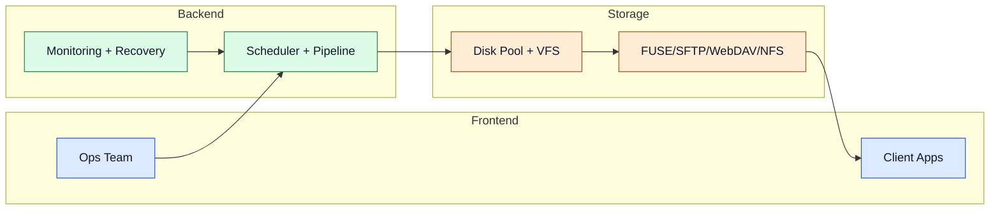

# Use Cases

Deze scenario's tonen praktische deployments van MultiDisk FileBalancer in productie-achtige omgevingen.

## Scenario-overzicht

## Praktische voorbeelden

- **Geautomatiseerde backupserver:** backup-outputs ingesteren, overdrachten via leeftijdsgrens beheren en vrije ruimte beschermen met cleanup-regels.
- **Media-archiefplatform:** meerdere schijven samenvoegen onder één namespace en remote leesbewerkingen aanbieden via SFTP of WebDAV.
- **Thuis- of KMO-NAS:** opslag incrementeel uitbreiden zonder RAID-striping beperkingen.
- **Data-ingest pipeline:** bestanden snel verzamelen, queue-uitvoering prioriteren en post-move integriteit valideren.
- **Migratie en herverwerking:** reverse workflows gebruiken om bestanden terug te brengen naar centrale verwerkingsfasen.
- **Linux VM-omgeving:** het programma draaien in een Debian VM op VirtualBox met gedeelde mappen als schijfpoel — zie de [Virtualisatiegids](./virtualisatie).

## Praktische scenario's

- **Schijfuitval:** operaties voortzetten op gezonde schijven met geïsoleerde impact.
- **Piekbelasting:** queueing en scanintervallen afstemmen voor voorspelbare doorvoer.
- **Gemengde protocol-clients:** één VFS blootstellen aan lokale mounts en NFS-clients tegelijkertijd.
- **Automatische opruiming:** Space Hunter instellen om de oudste bestanden te verwijderen of te verplaatsen zodra vrije ruimte een drempel bereikt.

Geavanceerde details

- Voeg webhook-gebaseerde notificaties toe voor operationele observability via Discord.
- Koppel gezondheidsmetrics aan proactieve cleanup-drempels.
- Gebruik gefaseerde uitrol van optionele protocols om troubleshooting te vereenvoudigen.

## Navigatie

- [Terug naar Intro](./intro)

## Gerelateerde pagina's

- [Architecture](./architecture)
- [Storage Layer](./storage-layer)
- [Access Layer](./access-layer)
- [Configuration](./configuration)
- [Virtualisatiegids](./virtualisatie)
