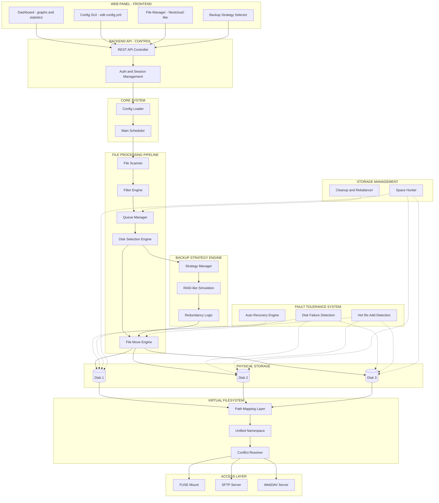

# FileBalancer Architecture (Advanced)

> Software-defined storage balancer with virtual filesystem abstraction

## Overview
This diagram represents a modular storage system with:
- Web interface (frontend)
- Backend control/API
- File processing pipeline
- Storage & virtual filesystem abstraction
- Fault tolerance & backup strategies

---

## Architecture Diagram

---

## Key Concepts

- File-level distribution (not block-level like RAID)
- Virtual filesystem abstraction
- Multiple access protocols (FUSE, SFTP, WebDAV)
- Fault tolerance and recovery
- Configurable backup strategies
- Scalable architecture

---

## Summary

This system acts as a:

**Modular storage orchestration platform combining flexibility, accessibility, and automation without relying on traditional RAID.**
