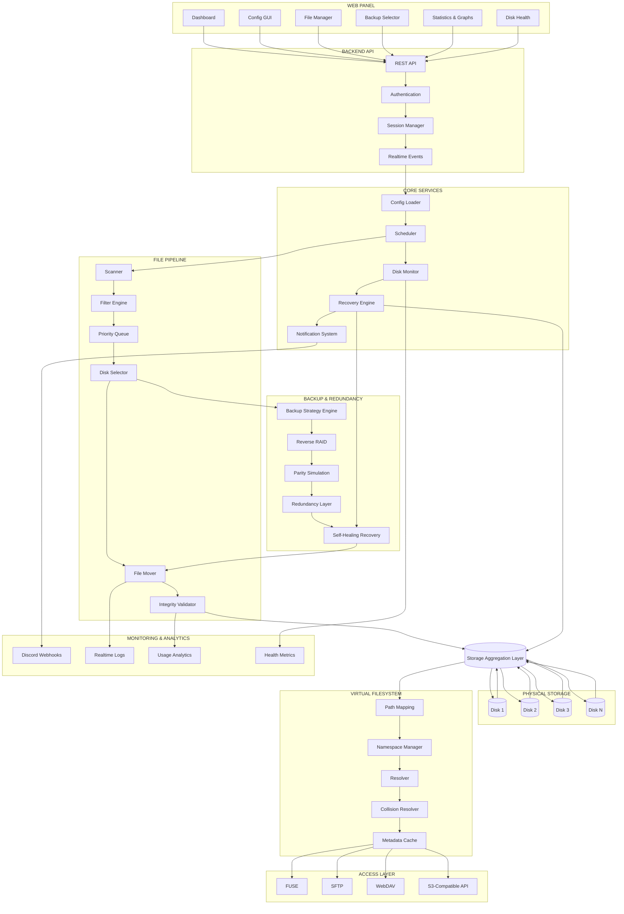

# FileBalancer Architecture (Advanced)

> Distributed software-defined storage orchestration platform with virtual filesystem abstraction, intelligent balancing, and multi-protocol access.

---

# Overview

FileBalancer is a modular storage orchestration platform designed to combine:

- Intelligent multi-disk balancing
- Virtual filesystem aggregation
- Multiple access protocols
- Automated backup & redundancy strategies
- Self-healing storage recovery
- Unified web management
- Distributed storage abstraction

The platform allows multiple physical disks to behave as a single flexible storage layer without relying on traditional hardware RAID.

---

# Architecture Diagram

---

# Core Features

## Intelligent Multi-Disk Balancing

FileBalancer automatically distributes files across multiple disks based on:

- Available free space
- Configurable safety margins
- File age
- Redundancy strategy
- Recovery state

This allows storage pools to scale dynamically without requiring traditional RAID arrays.

---

## Virtual Filesystem Layer

The Virtual Filesystem (VFS) aggregates multiple physical disks into a single unified namespace.

Features include:

- Dynamic path resolution
- Metadata caching
- Collision-safe virtual naming
- Unified directory structure
- Transparent file access
- Multi-source aggregation

Applications interact with a single virtual storage layer while FileBalancer manages the underlying disk layout.

---

## Multi-Protocol Access

The storage pool can be accessed through multiple protocols simultaneously:

| Protocol | Purpose |
|---|---|
| FUSE | Native filesystem mounting |
| SFTP | Secure remote file access |
| WebDAV | Web-based filesystem access |
| S3-Compatible API | Object storage integration |

This enables compatibility with:

- Linux
- Windows
- macOS
- Nextcloud
- Rclone
- Backup tools
- Cloud-native software
- Media servers

---

# Web Management Panel

The integrated web panel provides centralized management and monitoring.

## Dashboard

The dashboard displays:

- Disk usage
- Free space
- Storage growth
- File distribution
- Transfer activity
- Health status
- Active recovery jobs

## Configuration GUI

All configuration values can be modified through the GUI without manually editing YAML files.

## File Manager

The web file manager provides:

- Uploads & downloads
- Drag-and-drop support
- Remote browsing
- File operations
- Search functionality
- Multi-user access

## Backup Strategy Selector

Administrators can dynamically switch between:

- Balanced mode
- Mirrored mode
- Reverse RAID mode
- Parity simulation mode
- Archive mode

---

# Backup & Recovery System

## Reverse RAID

Reverse RAID distributes files across multiple disks while maintaining centralized accessibility through the virtual filesystem layer.

## Redundancy Engine

The redundancy system supports:

- Replication
- Parity simulation
- Configurable redundancy levels
- Automatic validation
- Recovery verification

## Self-Healing Recovery

If disks are disconnected or fail:

- The system continues operating
- Missing disks are detected automatically
- Reconnected disks are reintegrated
- Metadata is rebuilt automatically
- Recovery tasks are scheduled dynamically

---

# Monitoring & Analytics

FileBalancer includes a realtime monitoring system with:

- Discord webhook notifications
- Transfer logs
- Disk health monitoring
- Recovery alerts
- Usage analytics
- Performance statistics
- Historical graphs

---

# Automation Features

## Space Hunter

The Space Hunter subsystem automatically:

- Detects low disk space
- Removes old files
- Moves cold data
- Applies cleanup policies
- Protects excluded directories

## Intelligent Scheduling

The scheduler dynamically manages:

- File balancing
- Cleanup jobs
- Recovery jobs
- Integrity scans
- Backup tasks

---

# Fault Tolerance

FileBalancer is designed for resilient operation.

Features include:

- Graceful degraded mode
- Missing disk tolerance
- Automatic recovery
- Path safety validation
- Corruption prevention
- Concurrent operation protection
- Cache invalidation safeguards

---

# Scalability

The platform supports:

- Large multi-disk arrays
- Heterogeneous storage devices
- Incremental scaling
- Distributed access
- Mixed workloads
- High-capacity archival storage

---

# Summary

FileBalancer acts as a:

> Modular distributed storage orchestration platform combining intelligent balancing, redundancy, virtualization, automation, and multi-protocol accessibility without relying on traditional hardware RAID.

It bridges the gap between:

- Traditional RAID systems
- NAS software
- Cloud object storage
- Virtual filesystems
- Backup orchestration platforms

